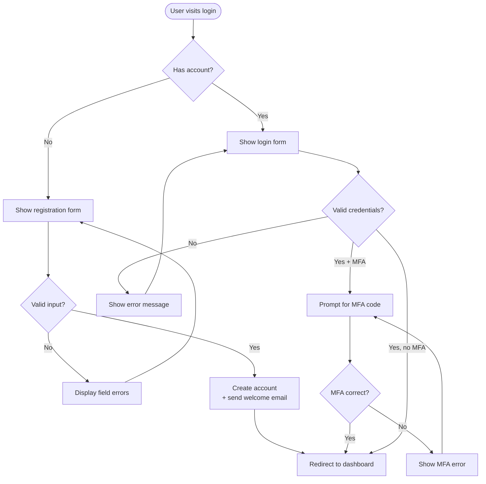

## What Is Mermaid JS?

Mermaid JS is a JavaScript library that renders diagrams from Markdown-like text definitions. Instead of dragging boxes and arrows in a GUI tool, you write:

```
flowchart LR
    A --> B
```

And Mermaid turns it into an SVG diagram. The diagram lives alongside your code, under version control, reviewable in pull requests.

---

## The Syntax

### Flowcharts

Flowcharts connect nodes with edges. Nodes can be rectangles, rounded boxes, diamonds (decisions), or circles (start/end):



Notice the syntax: `Node -->|"edge label"| OtherNode`. The direction is set by `TD` (top-down), `LR` (left-right), or `BT` (bottom-top). Use `[]` for rectangles, `{}` for diamonds, `()` for rounded nodes, and `([...])` for stadium-shaped nodes.

### Sequence Diagrams

Great for API call flows between services:

```
sequenceDiagram
    Alice->>John: Hello John, how are you?
    John-->>Alice: Great!
```

### Class Diagrams

Model domain objects and their relationships:

```
classDiagram
    class Animal {
        +String name
        +move()
    }
    class Dog {
        +bark()
    }
    Animal <|-- Dog
```

### Entity-Relationship Diagrams

Visualize database schemas:

```
erDiagram
    USER ||--o{ ORDER : places
    ORDER ||--|{ LINE_ITEM : contains
```

### State Diagrams

Track state transitions:

```
stateDiagram-v2
    [*] --> Idle
    Idle --> Processing : submit
    Processing --> Completed : done
    Processing --> Idle : reset
```

### Gantt Charts

Sprint timelines and project planning:

```
gantt
    title Sprint 1
    dateFormat  YYYY-MM-DD
    section Backend
    Auth API        :done, a1, 2026-03-01, 3d
    Payment module  :active, a2, 2026-03-04, 5d
```

---

## How to Use Mermaid

Three common approaches:

1. **In-browser rendering** - include the Mermaid CDN script. Any `<pre class="mermaid">` block on the page is automatically rendered.
2. **Markdown integration** - platforms like GitHub, GitLab, and Notion render ` ```mermaid ` blocks natively. Just paste the code and the diagram appears.
3. **CLI tool** - `npx @mermaid-js/mermaid-cli` converts `.mmd` files to PNG/SVG for use in documents or presentations.

In this blog, Mermaid code blocks are rendered live using the Mermaid JS library - what you see above is generated directly from the source text.

---

## Why Diagram as Code

- **Version control** - every diagram change has a git history. You can see when and why a node was added or removed.
- **Reviewable diffs** - a Mermaid diff is plain text. Changing a label or adding an edge shows up clearly in a pull request.
- **No lock-in** - Mermaid files work in GitHub, GitLab, Notion, and any Markdown renderer.
- **Speed** - writing `A --> B{"Condition"} -->|"edge"| C` takes seconds. No GUI tool can match that.
- **Documentation stays in sync** - the diagram lives in the same repo as the code. When the code changes, the diagram changes in the same PR.

---

Mermaid JS turns diagrams from artifacts you tolerate into tools you actually use. Pick a diagram type, write the syntax, and commit it alongside your code.
