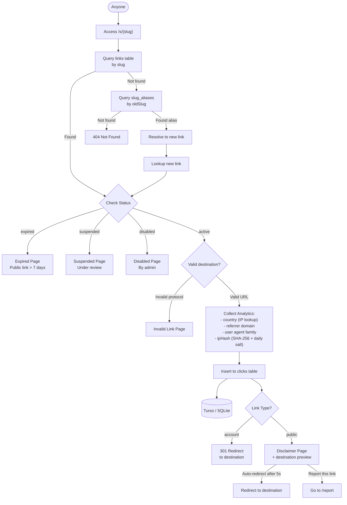

## Why Diagram as Code

Every development team faces the same problem: architecture diagrams are always out of date. The Visio file sits on a shared drive from two years ago. The Draw.io diagram lives on someone's local machine. By the time a new engineer joins, the diagram bears no resemblance to the actual system.

**Mermaid JS** solves this by treating diagrams as code — version-controlled, reviewable, and generated from a Markdown-like syntax.

---

## A Real Example: URL Shortener Resolution Flow

During a technical planning meeting at Sevima, we needed to design the link resolution pipeline for a URL shortener feature. The CTO wanted to see every edge case — expired links, suspended content, alias resolution — in a single diagram. Instead of reaching for a GUI tool, I wrote this in real-time:

The diagram captures the full decision tree: slug lookup, alias fallback, status checks, analytics collection, and the final redirect path. Every conditional branch is explicit — nothing is hidden in implicit logic.

---

## How We Used It in Sevima Dev Planning

In Sevima's development planning process, the CTO held weekly technical meetings where feature squads presented their architecture proposals. The format was straightforward:

1. **The squad lead opens a Markdown file** with embedded Mermaid diagrams
2. **Diagrams are projected** during the meeting and reviewed line-by-line
3. **The CTO marks concerns** directly on specific nodes or edges
4. **Changes are committed** to the proposal branch before the meeting ends

This replaced our old flow where someone would spend two hours in a GUI tool, export a PNG, and then the diagram would immediately drift as the implementation diverged.

### Why It Worked

- **Version control** — every diagram change has a git history. We could see when and why a decision node was added or removed.
- **Reviewable diffs** — a Mermaid diff is text. Changing a node label or adding an edge shows up clearly in a PR.
- **No lock-in** — Mermaid files are plain text. They work in GitHub, GitLab, Notion, and any Markdown renderer.
- **Speed** — writing `A --> B{"Condition"} -->|"edge"| C` is faster than dragging boxes and arrows.

---

## The Impact

The technical planning process became more rigorous. Diagrams that were once vaguely descriptive became executable specifications. The CTO could ask "what happens when the slug is an alias *and* the resolved link is expired?" and we could trace the exact path through the diagram rather than guessing.

The URL shortener itself went from concept to production in two sprints. The Mermaid diagram served as the single source of truth throughout implementation — engineers referenced it during coding, QA used it to design test cases, and the tech writer used it for documentation.

---

## Beyond Flowcharts

Mermaid supports many diagram types we used regularly:

- **Sequence diagrams** for API call flows between microservices
- **Class diagrams** for domain model discussions
- **Entity-relationship diagrams** for database schema reviews
- **State diagrams** for order lifecycle tracking
- **Gantt charts** for sprint planning

---

Mermaid JS turned diagrams from artifacts we tolerated into tools we used. If your team still draws architecture in a GUI tool and exports PNGs, try embedding Mermaid in your next design doc. The diff alone is worth the switch.
